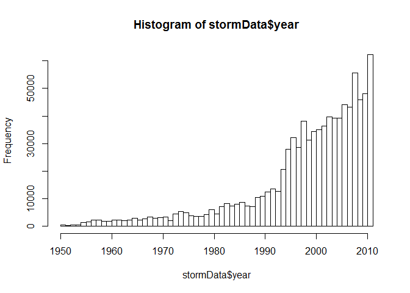
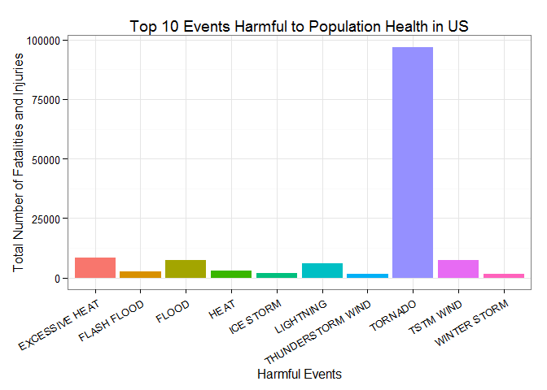
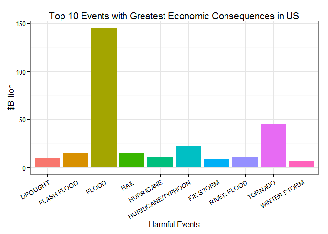

# Reproducible Research: Peer Assessment 2

## Impact of Severe Weather Events on Public Health and Economy in the United States

### Synonpsis  
In this report we aim to answer some basic questions about severe weather events.  Specifically, we try to identify which types of events are the most harmful to population health and the most deleterious to the economy.

To answer these questions, we obtained the storm database from the U.S. National Oceanic and Atmospheric Administration's (NOAA).  This database tracks characteristics of major storms and weather events in the United States, including estimates of any fatalities, injuries, property and crop damage.

From this dataset, we found that tornadoes and heat are the severe weather event types by far most dangerous to people, while flooding, hurricanes, and storm surges are the most costly event types to the economy.  Interestingly, only flooding is one of the top three most dangerous or most costly event types.

### Basic settings


```r
library(ggplot2)
```

### Getting and Loading the Data

Data can be downloaded from this location 
https://d396qusza40orc.cloudfront.net/repdata%2Fdata%2FStormData.csv.bz2


```r
# Load the storm dataset
if (!"stormData" %in% ls()) {
  stormData <- read.csv(bzfile("repdata-data-StormData.csv.bz2"), sep = ",")
  }
```


```r
# (optional)
# Before proceeding further with the data, let's check on the size, structure and results summaries of the data. 
# summary(stormData)
# names(stormData)
```


The dataset contains 902297 obs. and 38 variables in total.

## Data Processing

The events in the database start in the year 1950 and end in November 2011. In the earlier years of the database there are generally fewer events recorded. 


```r
# normalize the year column format and plot the histogram 
stormData$year <- as.numeric(format(as.Date(stormData$BGN_DATE, format = "%m/%d/%Y %H:%M:%S"), "%Y"))
hist(stormData$year, breaks = 45)
```

 


## Impact on Public Health
To study the impact on the public health, we will check the number of **fatalities** and **injuries** that are caused by the severe weather events. For this study, we would like to limit the result to the first 10 most severe types of weather events.


```r
#subset the storm dataset
harmful <- stormData[,c("EVTYPE", "FATALITIES", "INJURIES")]
harmful["health"] <- harmful$FATALITIES + harmful$INJURIES

# split the sub dataset by EventType and apply the sum function
sum_health <- sapply(split(harmful, harmful$EVTYPE), function(x) sum(x[, c("health")]))

# get the top 10 rows (sorted) from the calculated data
top10ImpactHealth <- sort(sum_health, decreasing = TRUE)[1:10]


# plot top 10 fatalities and injuries events
Events <- factor(names(top10ImpactHealth))
qplot(x = Events, y = top10ImpactHealth, geom = "bar", stat = "identity", xlab = "Harmful Events", 
    fill = Events, ylab = "Total Number of Fatalities and Injuries") + 
    ggtitle("Top 10 Events Harmful to Population Health in US") + 
    theme_bw() + guides(fill = FALSE) + 
    theme(axis.text.x = element_text(angle = 30, hjust = 1))
```

 

### Results

The above histogram shows that **tornado** cause most fatalities and most injuries in the United States from 1995 to 2011.


## Impact on Economy
To study the impact on the economy, We need to convert the **property damage** and **crop damage** data into comparable numerical forms according to the meaning of units described in the code book ([Storm Events](http://ire.org/nicar/database-library/databases/storm-events/)). 
`PROPDMGEXP` and `CROPDMGEXP` columns record a multiplier for each observation where we have:
Hundred (H), Thousand (K), Million (M) and Billion (B). Each letter should be replaced by a 10^x multiplicator where x is:
B => 9, M => 6, K => 3, H => 2


```r
# subset the dataset to get the total number of property damages and crop
# damages relating to each event
damages <- stormData[, c("EVTYPE", "PROPDMG", "PROPDMGEXP", "CROPDMG", "CROPDMGEXP")]

# sum up the property damages
damages$PROPDMGEXP <- as.character(damages$PROPDMGEXP)
damages$PROPDMGEXP[(damages$PROPDMGEXP == "H")] <- "00"
damages$PROPDMGEXP[(damages$PROPDMGEXP == "K")] <- "000"
damages$PROPDMGEXP[(damages$PROPDMGEXP == "M")] <- "000000"
damages$PROPDMGEXP[(damages$PROPDMGEXP == "B")] <- "000000000"
damages$PROPDMG <- paste(damages$PROPDMG, damages$PROPDMGEXP, sep = "")
damages$PROPDMG <- as.numeric(damages$PROPDMG)
```

```
## Warning: NAs introduced by coercion
```

```r
damages$CROPDMGEXP <- as.character(damages$CROPDMGEXP)
damages$CROPDMGEXP[(damages$CROPDMGEXP == "H")] <- "00"
damages$CROPDMGEXP[(damages$CROPDMGEXP == "K")] <- "000"
damages$CROPDMGEXP[(damages$CROPDMGEXP == "M")] <- "000000"
damages$CROPDMGEXP[(damages$CROPDMGEXP == "B")] <- "000000000"
damages$CROPDMG <- paste(damages$CROPDMG, damages$CROPDMGEXP, sep = "")
damages$CROPDMG <- as.numeric(damages$CROPDMG)
```

```
## Warning: NAs introduced by coercion
```

```r
# divid he value by 1e+09 to get it in $Billion 
damages$ecodmg <- (damages$PROPDMG + damages$CROPDMG)/1e+09

# rid of NAs
damages$ecodmg[which(is.na(damages$ecodmg))] <- 0

# split and sum the data by event types
sum_ecodmg <- sapply(split(damages, damages$EVTYPE), function(x) sum(x[, c("ecodmg")]))

# get the top 10 rows (sorted) from the calculated data
top10ImpactEconomy <- sort(sum_ecodmg, decreasing = TRUE)[1:10]


# plot top 10 property damage events
Events <- factor(names(top10ImpactEconomy))
qplot(x = Events, y = top10ImpactEconomy, geom = "bar", stat = "identity", xlab = "Harmful Events", 
    fill = Events, ylab = "$Billion") + 
    ggtitle("Top 10 Events with Greatest Economic Consequences in US") + 
    theme_bw() + guides(fill = FALSE) + theme(axis.text.x = element_text(angle = 30, hjust = 1))
```

 

### Results

Based on the above plots, we find that **flood** causes most property damage in the United States from 1995 to 2011.

### Conclusion  
By analyzing this dataset, we found that **tornado** are most harmful with respect to population health, while **flood** has the greatest economic consequences.
